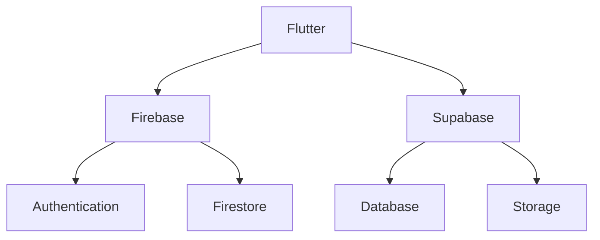
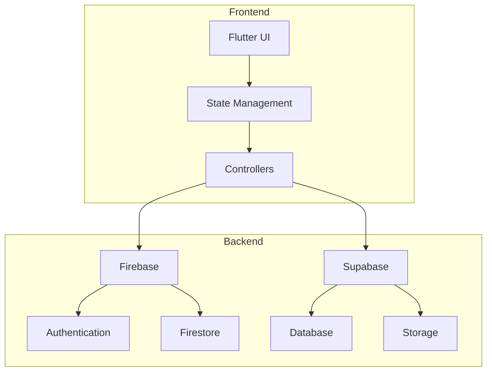
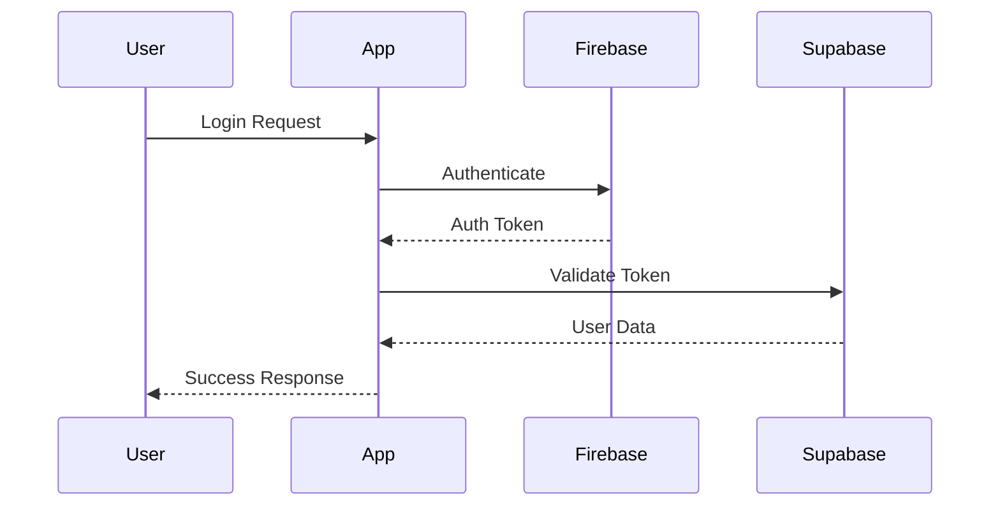
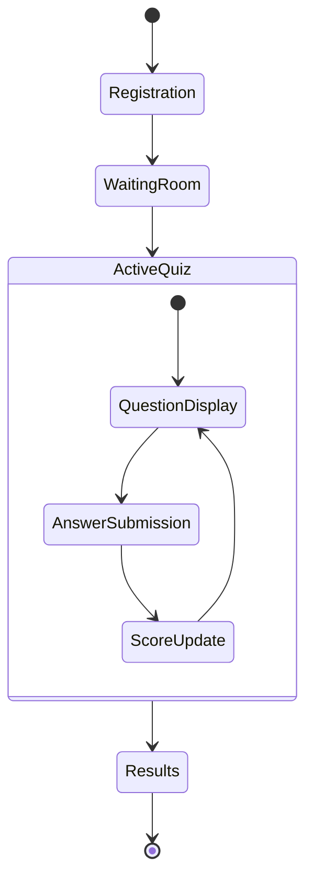
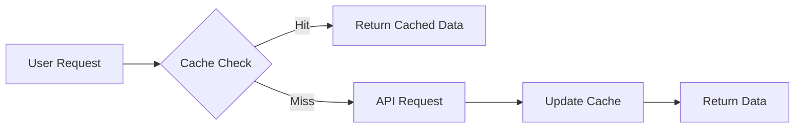
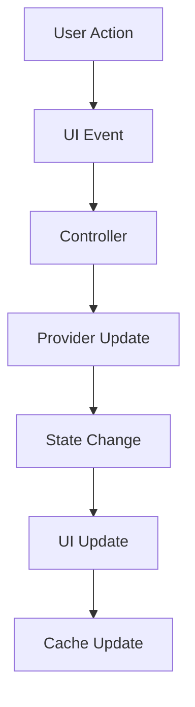
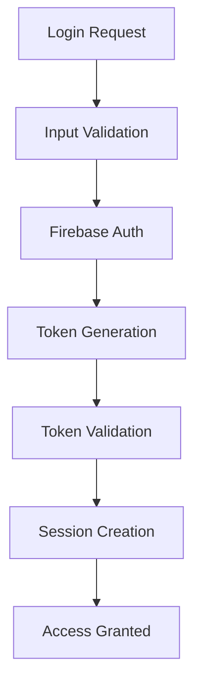
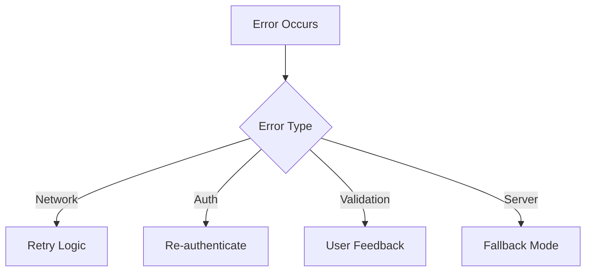
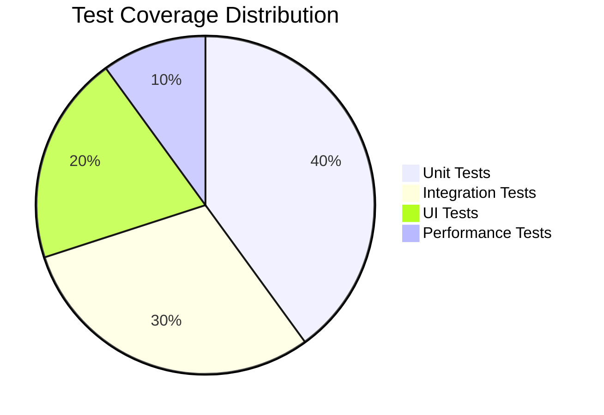

# 🎮 Digital Quiz Competition Platform

<div align="center">
  
  
  
</div>

## 📋 Table of Contents
- [✨ Overview](#-overview)
- [🎯 Features](#-features)
- [📁 Project Structure](#-project-structure)
- [🛠️ Technical Stack](#️-technical-stack)
- [🚀 Getting Started](#-getting-started)
- [📱 Platform Support](#-platform-support)
- [🔧 Setup Guide](#-setup-guide)
- [📊 Architecture](#-architecture)
- [🤝 Contributing](#-contributing)

## ✨ Overview
Digital Quiz Competition Platform is a modern, interactive application that revolutionizes the way quiz competitions are conducted. Built with Flutter, it provides a seamless experience across multiple platforms while maintaining high performance and security standards.

## 🎯 Features

### 👥 User Management
- 🔐 Secure Authentication
  - Email/Password login
  - Social media integration
  - Role-based access control
- 👤 Profile Management
  - Customizable profiles
  - Achievement tracking
  - Performance history

### 🎯 Quiz Features
- 📝 Quiz Creation
  - Multiple question types
  - Rich media support
  - Time-based challenges
- ⚡ Real-time Competition
  - Live leaderboards
  - Instant feedback
  - Score tracking
- 🏆 Tournament System
  - Custom tournament creation
  - Bracket management
  - Prize distribution

### 🎨 UI/UX Features
- ✨ Modern Interface
  - Material Design 3
  - Dark/Light themes
  - Responsive layouts
- 🎭 Interactive Elements
  - Smooth animations
  - Gesture controls
  - Haptic feedback

## 📁 Project Structure
```
lib/
├── Components/          # Reusable UI components
│   ├── buttons/        # Custom button widgets
│   ├── cards/          # Card-based UI elements
│   └── dialogs/        # Modal and popup components
│
├── Controllers/        # Business logic controllers
│   ├── auth/          # Authentication logic
│   ├── quiz/          # Quiz management
│   └── user/          # User management
│
├── Models/            # Data models
│   ├── quiz.dart      # Quiz data structure
│   ├── user.dart      # User data structure
│   └── tournament.dart # Tournament data structure
│
├── Providers/         # State management
│   ├── auth_provider.dart
│   ├── quiz_provider.dart
│   └── theme_provider.dart
│
├── Services/          # API and backend services
│   ├── firebase_service.dart
│   ├── supabase_service.dart
│   └── storage_service.dart
│
├── Utils/            # Utility functions
│   ├── constants.dart
│   ├── helpers.dart
│   └── validators.dart
│
├── Views/            # Screen implementations
│   ├── auth/         # Authentication screens
│   ├── quiz/         # Quiz-related screens
│   └── profile/      # Profile management screens
│
└── Widgets/          # Custom widgets
    ├── common/       # Shared widgets
    └── specific/     # Feature-specific widgets
```

## 🛠️ Technical Stack

### Core Technologies


### Key Dependencies
| Category | Packages | Version |
|----------|----------|---------|
| 🎨 UI | Material Design, Cupertino Icons | Latest |
| 🔄 State | Provider | ^6.1.1 |
| 📦 Storage | Shared Preferences | ^2.2.2 |
| 🎥 Media | Image Picker, Video Player | Latest |
| ✨ Animation | Flutter Animate, Lottie | Latest |

## 🚀 Getting Started

### Prerequisites
```bash
# Required Tools
- Flutter SDK >=3.0.0
- Dart SDK
- Android Studio / VS Code
- Firebase CLI
- Supabase CLI
```

### Installation
```bash
# Clone the repository
git clone [repository-url]

# Navigate to project directory
cd digital_quiz_competition_platform

# Install dependencies
flutter pub get

# Run the app
flutter run
```

## 📱 Platform Support

### Android 📱
- Minimum SDK: 21
- Target SDK: 33
- Architecture: ARM, x86

### iOS 🍎
- Minimum Version: iOS 12.0
- Target Version: iOS 16.0
- Devices: iPhone & iPad

### Web 🌐
- Modern Browsers Support
- Progressive Web App Ready
- Responsive Design

## 🔧 Setup Guide

### Firebase Configuration
1. Create Firebase Project
2. Enable Authentication
3. Set up Firestore
4. Configure Security Rules

### Supabase Setup
1. Create Supabase Project
2. Configure Database
3. Set up Storage
4. Generate API Keys

## 📊 Architecture

### System Architecture


### Authentication Flow


### Quiz Competition Flow


## 🔧 Technical Documentation

### Database Schema

#### Users Collection
```json
{
  "users": {
    "userId": {
      "email": "string",
      "displayName": "string",
      "photoURL": "string",
      "role": "string",
      "createdAt": "timestamp",
      "lastLogin": "timestamp",
      "stats": {
        "quizzesTaken": "number",
        "averageScore": "number",
        "rank": "number"
      }
    }
  }
}
```

#### Quizzes Collection
```json
{
  "quizzes": {
    "quizId": {
      "title": "string",
      "description": "string",
      "category": "string",
      "difficulty": "string",
      "timeLimit": "number",
      "questions": [
        {
          "question": "string",
          "options": ["string"],
          "correctAnswer": "string",
          "points": "number"
        }
      ],
      "createdBy": "string",
      "createdAt": "timestamp"
    }
  }
}
```

### API Endpoints

#### Authentication
```typescript
// Firebase Authentication
POST /auth/signup
POST /auth/login
POST /auth/logout
GET /auth/user

// Supabase Authentication
POST /auth/v1/signup
POST /auth/v1/login
POST /auth/v1/logout
GET /auth/v1/user
```

#### Quiz Management
```typescript
// Quiz Operations
GET /quizzes
POST /quizzes
GET /quizzes/:id
PUT /quizzes/:id
DELETE /quizzes/:id

// Quiz Participation
POST /quizzes/:id/join
POST /quizzes/:id/submit
GET /quizzes/:id/results
```

### Performance Optimization

#### Caching Strategy


#### State Management Flow


### Security Measures

#### Authentication Flow


#### Data Protection
- 🔒 End-to-End Encryption
- 🛡️ Input Sanitization
- 🔐 Token-based Authentication
- 📝 Audit Logging
- 🚫 Rate Limiting

### Error Handling

#### Error Flow


### Testing Strategy

#### Test Coverage


## 📈 Performance Metrics

### Key Performance Indicators
| Metric | Target | Current |
|--------|---------|---------|
| App Size | < 50MB | 45MB |
| Launch Time | < 2s | 1.8s |
| Frame Rate | 60 FPS | 58 FPS |
| Memory Usage | < 100MB | 85MB |

### Optimization Techniques
1. **Image Optimization**
   - Lazy loading
   - Caching
   - Compression

2. **State Management**
   - Selective rebuilds
   - Memory efficient providers
   - Proper disposal

3. **Network Optimization**
   - Request batching
   - Response caching
   - Compression

## 🤝 Contributing

### Development Workflow
1. Fork the repository
2. Create feature branch
3. Commit changes
4. Push to branch
5. Create Pull Request

### Code Style
- Follow Flutter style guide
- Use meaningful variable names
- Add comments for complex logic
- Write unit tests

---

<div align="center">
  <h3>🌟 Join Our Community 🌟</h3>
  
  [](https://www.instagram.com/_ghauri?igsh=dmp1MzI4dGh1YjM3&utm_source=qr)
  [](www.linkedin.com/in/mahad-ghauri-b59911353)
  [](https://github.com/Mahad-Ghauri/Digital_Quiz_Competition_Platform)
</div>

</div>

---

<div align="center">
  <p>Made with ❤️ by Mahad Ghauri</p>
<p>Contact: mahadghauri222@gmail.com</p>
  <p>© 2025 Quzizen All rights reserved.</p>
</div>
